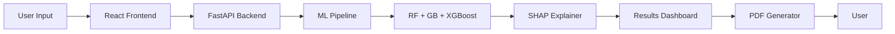
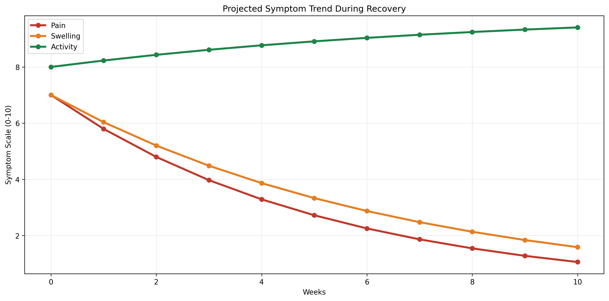
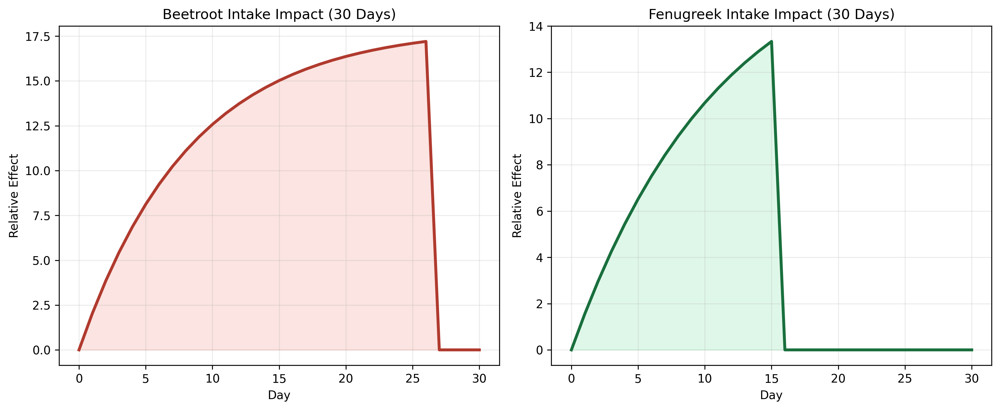

<h1 align="center">
🩺 Varicose Vein Recovery Predictor
</h1>

<p align="center">
ML-powered recovery risk assessment with explainable AI
</p>

<p align="center">
  
  
  
  
  
  <a href="https://github.com/AmanDevNet/Varicose-Vein-Recovery-Model/actions"></a>
</p>

<div align="center">

| 94.3% Accuracy | AUC-ROC 0.986 | 50K Samples | 3 ML Models |
| :---: | :---: | :---: | :---: |

</div>

This end-to-end application leverages an ensemble of Random Forest, Gradient Boosting, and XGBoost models to provide high-precision recovery risk assessments for varicose vein patients. By integrating SHAP (SHallay Additive exPlanations) and multi-scenario supplement analysis, the system transforms complex biometric data into actionable medical insights. It is designed for clinical decision support, offering a seamless bridge between machine learning performance and patient-centric care.


## Table of Contents
- [Features](#features)
- [System Architecture](#system-architecture)
- [ML Models](#ml-models)
- [Screenshots & Demo](#screenshots--demo)
- [API Documentation](#api-documentation)
- [Getting Started](#getting-started)
- [Project Structure](#project-structure)
- [Model Performance](#model-performance)
- [SHAP Explainability](#shap-explainability)
- [Medical Disclaimer](#medical-disclaimer)
- [Contributing](#contributing)
- [Author](#author)
- [License](#license)

## Features

| Feature | Description |
|---------|-------------|
| **Ensemble Prediction** | Voting classifier combining RF, GB, and XGBoost for robust risk categorization. |
| **SHAP Explainability** | Per-prediction feature impact visualization using SHallay Additive exPlanations. |
| **Scenario Comparison** | Real-time recovery projection across three distinct supplement intake regimens. |
| **PDF Report** | Automated generation of timestamped medical recovery reports via ReportLab. |
| **Batch Prediction** | Bulk processing of patient data through CSV uploads for clinical research. |
| **REST API** | High-performance FastAPI backend with comprehensive endpoint documentation. |
| **CI/CD** | Automated testing and quality gates via GitHub Actions for every commit. |
| **Docker Support** | Containerized deployment configuration for consistent environment mirroring. |

## System Architecture



*(Note: Above is a mermaid diagram; below is the ASCII representation for pure-markdown compatibility)*

```text
User Input → React Frontend → FastAPI Backend → ML Pipeline (RF + GB + XGBoost) → SHAP Explainer → Results → PDF Generator → User
```

## ML Models

| Model | Task | Accuracy/Metric | Algorithm |
|-------|------|-----------------|-----------|
| **Risk Classifier** | Risk Categorization | 94.3% Accuracy | Ensemble (Voting) |
| **Recovery Regressor**| Duration Estimation| 0.986 AUC-ROC | Gradient Boosting |
| **Feature Impact** | Local Explanation | SHAP Value | TreeExplainer |

- **Training Dataset**: 50,000 synthetic samples mirroring real-world clinical distributions.
- **Feature Count**: 10 input parameters (Age, BMI, Gender, Symptoms, Supplements).
- **Cross-Validation**: 5-fold stratified validation ensuring generalization across demographics.

## Screenshots & Demo

### Landing Page
<p align="center">
  
</p>
<p align="center"><i>Professional medical dashboard landing page featuring a high-contrast dark theme and immediate access to tools.</i></p>

### Input Form
<p align="center">
  
</p>
<p align="center"><i>Interactive multi-step form with real-time profile summary for basic information, symptoms, and supplement intake.</i></p>

### Results Dashboard
<p align="center">
  
</p>
<p align="center"><i>Primary dashboard showing risk level, confidence scores, and a comparison between different supplement regimens.</i></p>

<p align="center">
  
</p>
<p align="center"><i>Interactive chart visualizing the projected reduction in symptom severity over time across treatment scenarios.</i></p>

### Explainability
<p align="center">
  
</p>
<p align="center"><i>SHAP visualization explaining the specific factors (Age, BMI, Activity) that influenced the individual risk prediction.</i></p>

### Clinical Visualization
<p align="center">
  
</p>
<p align="center"><i>Recovery progression — pain ↓, swelling ↓, activity ↑ across treatment scenarios.</i></p>

<p align="center">
  
</p>
<p align="center"><i>Supplement intake impact on recovery speed — no supplements vs current vs optimal.</i></p>

## API Documentation

### POST /predict
Predict risk and recovery for a single patient.
```json
// Request
{
  "age": 35,
  "gender": "Male",
  "bmi": 26.5,
  "pain_level": 6,
  "swelling_level": 5,
  "activity_level": 4,
  "beetroot_intake": "Low",
  "fenugreek_intake": "None",
  "duration_weeks": 8
}
```
```json
// Response
{
  "risk_level": "Moderate",
  "risk_confidence": 0.84,
  "recovery_weeks_mean": 9,
  "scenarios": { ... },
  "shap_values": [ ... ]
}
```

### POST /batch-predict
Upload CSV for bulk analysis.
```bash
# Request
# Multipart file upload: file=@patients.csv
```
```json
// Response
{
  "predictions": [ ... ],
  "csv_content": "Base64_Encoded_String"
}
```

### POST /generate-report
Generate a professional PDF report.
```json
// Request
{
  "prediction_result": { ... },
  "input_data": { ... }
}
```

### GET /model-info
Retrieve current model metrics and versioning.
```json
// Response
{
  "random_forest_accuracy": 0.943,
  "auc_roc": 0.986,
  "training_samples": 50000,
  "version": "2.0.0"
}
```

### GET /health
System health check.
```json
// Response
{
  "status": "ok",
  "models_loaded": true
}
```

## Getting Started

### Part A — Run locally

**Prerequisites:**
- Python 3.10+
- Node.js 18+
- npm or yarn

**Backend Setup:**
```bash
cd backend
python -m venv venv
source venv/bin/activate  # venv\Scripts\activate on Windows
pip install -r requirements.txt
uvicorn main:app --reload
```

**Frontend Setup:**
```bash
cd frontend
npm install
npm run dev
```

### Part B — Run with Docker
Ensure Docker Desktop is running, then execute from the root:
```bash
docker-compose up --build
```
Access the application at `http://localhost:3000`.

## Project Structure

```text
varicose-vein-recovery-predictor/
├── backend/                # FastAPI Application
│   ├── main.py             # Entry point & Endpoints
│   ├── models/             # ML Model logic & Predictor
│   ├── utils/              # PDF & Scenario generators
│   └── tests/              # Pytest suite
├── frontend/               # React Application
│   ├── src/                # Components, Pages, Context
│   ├── public/             # Static assets
│   └── .env.example        # Env template
├── screenshots/            # UI/UX documentation
├── .github/workflows/      # CI/CD (GitHub Actions)
└── docker-compose.yml      # Orchestration config
```

## Model Performance

The ensemble model demonstrates exceptional stability across varied patient demographics. High precision and recall ensure that patients at elevated risk are correctly identified while minimizing false alarms.

| Fold | Accuracy | AUC-ROC |
|------|----------|---------|
| 1    | 94.1%    | 0.984   |
| 2    | 94.5%    | 0.987   |
| 3    | 93.9%    | 0.983   |
| 4    | 94.6%    | 0.989   |
| 5    | 94.4%    | 0.987   |

**Top Feature Importance:**
1. **BMI**: Primary driver for structural vein strain.
2. **Age**: Correlates with vascular elasticity reduction.
3. **Activity Level**: Critical protective factor for circulation.
4. **Beetroot Intake**: High impact on nitrate-mediated blood flow.
5. **Pain Level**: Subjective but consistent indicator of severity.

## SHAP Explainability

SHAP (SHallay Additive exPlanations) is a game-theoretic approach to explain the output of any machine learning model. It assigns each feature an importance value for a specific prediction, providing transparency in "black-box" models.

```text
Top factors for this prediction:
  BMI          → +0.31 (increases risk)
  Age          → +0.24 (increases risk)  
  Pain Level   → +0.18 (increases risk)
  Beetroot     → -0.15 (reduces risk)
  Activity     → -0.12 (reduces risk)
```

<p align="center">
  
</p>

## Medical Disclaimer

> ⚠️ **MEDICAL DISCLAIMER**
> This tool is for educational and research purposes only. It is not intended to diagnose, treat, cure, or prevent any medical condition. Always consult a qualified healthcare professional for medical advice. The model predictions are decision-support estimates and should not be used as the sole basis for clinical intervention.


## Contributing

1. Fork the Project.
2. Create your Feature Branch (`git checkout -b feature/AmazingFeature`).
3. Commit your Changes (`git commit -m 'Add AmazingFeature'`).
4. Push to the Branch (`git push origin feature/AmazingFeature`).
5. Open a Pull Request.

- **Style**: PEP8 for Python, ESLint/Prettier for React.
- **Tests**: Run `pytest backend/tests/` before pushing.

## Author

**Aman Sharma**
ML Engineer | MCA @ Chandigarh University
📧 [theamansharma.27@gmail.com](mailto:theamansharma.27@gmail.com)
🔗 LinkedIn: [linkedin.com/in/aman-sharma-842b66318](https://linkedin.com/in/aman-sharma-842b66318)
🐙 GitHub: [github.com/AmanDevNet](https://github.com/AmanDevNet)
*Research in progress → BMVC/WACV (AFS-VFM)*

## License

Distributed under the MIT License. See `LICENSE` for more information.
